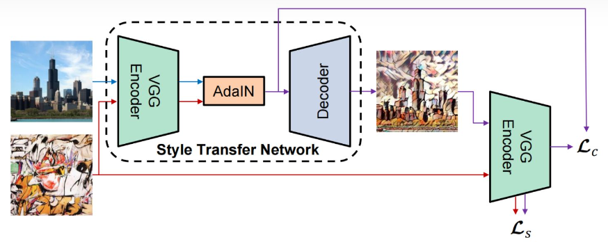

AdaIN模型的PyTorch实现.

AdaIN: Arbitrary Style Transfer in Real-time with Adaptive Instance Normalization

# 架构图

# Requirements
- Python 3.7+
- tqdm
- PyTorch 0.4+
- Pillow
  
# Usage
models.py文件是核心代码文件, 修改 '--content_dataset_path' 和 '--style_dataset_path' 参数为自己的内容图像和风格图像数据路径即可运行该python文件进行训练